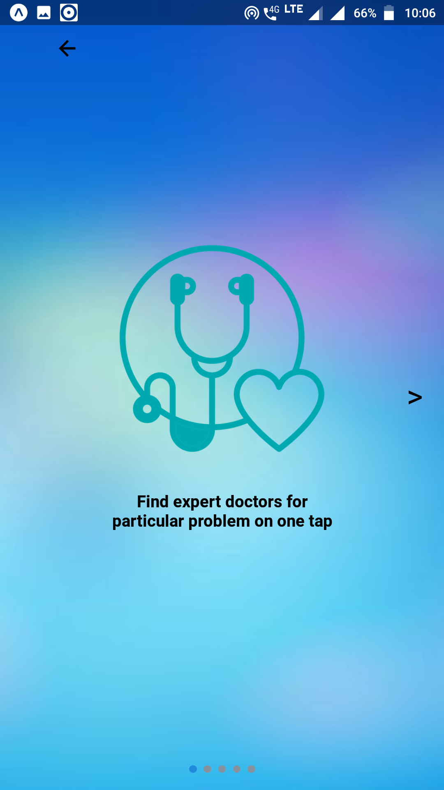
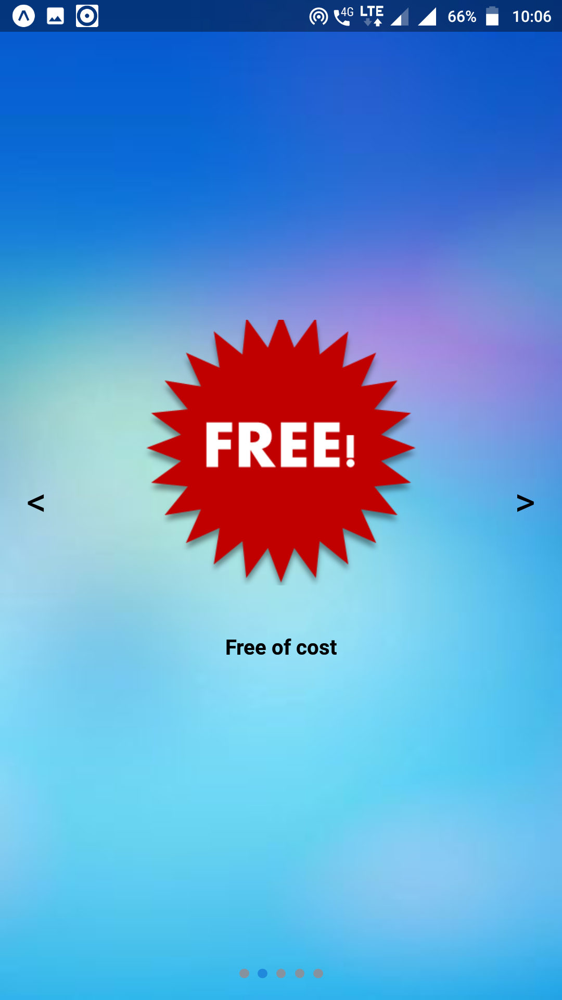
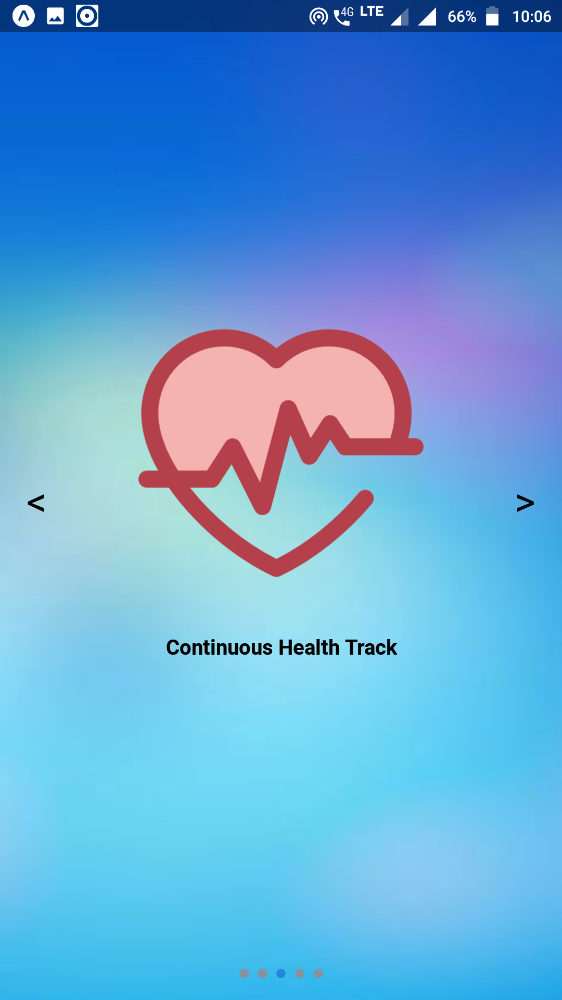
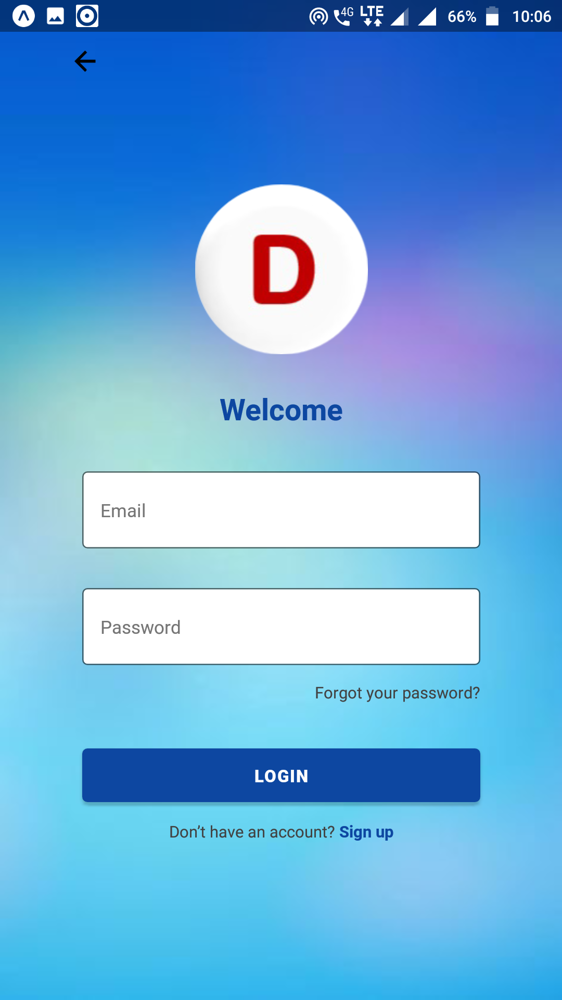
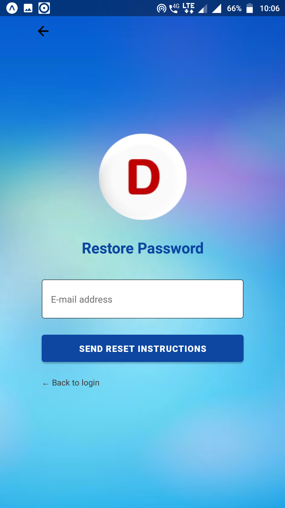

## Doc_Compo

### Components I made for DocMan 

#### Start Screen
You can find this screen file at
<a href="docman/src/screens/StartScreen.js">docman/src/screens/StartScreen.js</a>

#### Swiper Screens
You can find this screen file at
<a href="docman/src/screens/SwiperScreen.js">docman/src/screens/SwiperScreen.js</a>

    

#### Home Screen
You can find this screen file at
<a href="docman/src/screens/HomeScreen.js">docman/src/screens/HomeScreen.js</a>

#### Login Screen
You can find this screen file at
<a href="docman/src/screens/LoginScreen.js">docman/src/screens/LoginScreen.js</a>

#### Signup Screen
You can find this screen file at
<a href="docman/src/screens/RegisterScreen.js">docman/src/screens/RegisterScreen.js</a>

#### Forget Password Screen
You can find this screen file at
<a href="docman/src/screens/ForgotPasswordScreen.js">docman/src/screens/ForgotPasswordScreen.js</a>

